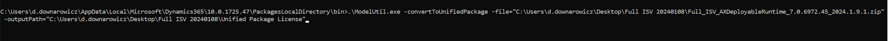
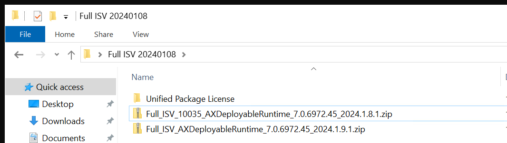
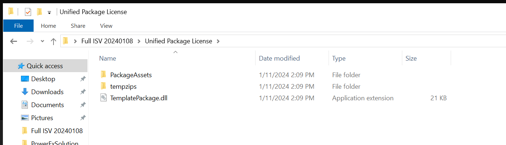
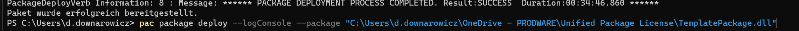

# Legacy package conversion and deployment


## Convert finance and operations apps packages to the new unified package format

This step is used to convert the existing Software deployable package, typically used by Lifecycle Services, into a new, unified, deployment package format. The package format is changed to align with other Dynamics 365 applications hosted by Microsoft Dataverse.

Run the following command using ModelUtil.exe from Windows PowerShell. You can find the .exe in your local PackageLocalDirectory, which was downloaded by Visual Studio during the setup.

```powershell
.\ModelUtil.exe -convertToUnifiedPackage -file=<PathToYourPackage>.zip -outputpath=<OutputPath>
```


{style="width:40%"}
{style="width:40%"}
## Upload the unified deployable package to the source environment
This deploy command makes no changes to the finance and operations environment hosted in Lifecycle Services, nor does it require any downtime to apply this package on either the operations environment or the Dataverse environment. This is done to upload and save the customizations into Dataverse storage so they can be copied.

1. Install PAC CLI.
2. Authenticate and connect to source Dataverse.
3. Run the following:

```powershell
pac auth list
pac auth select --index 1
pac package deploy --logConsole --package <OutputPath>\<Package>.dll
```

