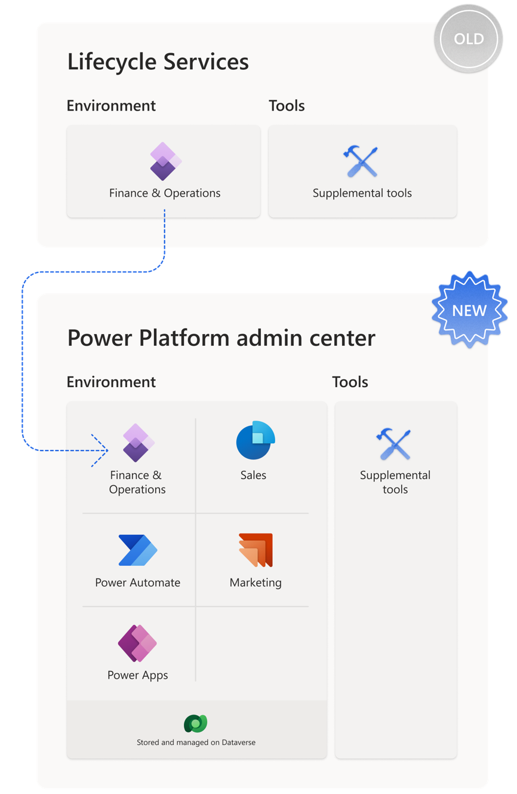

# Unified Experience - Overview

As part of the unification of admin experiences of finance and operations apps within Power Platform, the environment for finance and operations apps is now considered as an application within Power Platform. 

This means that multiple Dynamics 365 applications (such as Sales, Marketing, finance and operations) and apps, flows, and websites in Power Platform can be installed and hosted on the same Power Platform environment with a Dataverse database, providing a consistent and single set of lifecycle operations that an admin can perform across all of these artifacts.

{: style="height:600px"}

## Presentations

- [Presentation English (December 2023)](media/Unified%20Experience%20English%20(Preview%20Dec%202023).pdf)
- [Presentation German (October/November 2023)](media/Unified%20Experience%20German%20(Preview%20OctNov%202023).pdf)

## Recordings

- [Overview Recording Presentation (2023-12-29) (Sharepoint)](https://prodwarecloud.sharepoint.com/:v:/r/sites/DE-D365-AX/Shared%20Documents/General/Unified%20Experience/Unified%20Experience%20Presentation-20231229_145536-Besprechungsaufzeichnung.mp4?csf=1&web=1&e=HVagrg)
