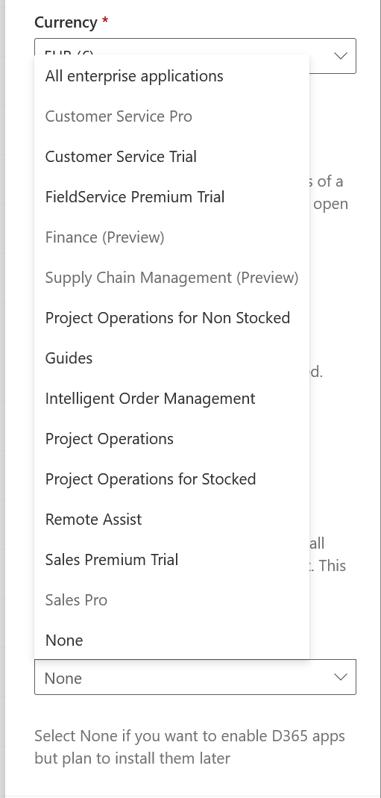

# Provision a new environment with an ERP-based template

Finance and operations apps have been reimagined as an application hosted by Microsoft Dataverse.  No longer do customers need to provision their enterprise resource planning (ERP) system separately from their low-code and other Dynamics 365 platform applications.  Additionally, most administrative actions in Power Platform are available through the admin center and an API-based experience.

In this tutorial, learn how to:

- Go to the Power Platform admin center and create a new environment using a template based on your assigned license.
- Provision a developer-focused sandbox using PowerShell to use with X++ code.
- Delete an environment when no longer in use.

As an example of this scenario, a customer who operates their finance and operations apps environments in Microsoft Dynamics 365 Lifecycle Services can provision one of the newer, developer-focused sandboxes in the Power Platform admin center.  

## Environment provisioning

The easiest way to get finance and operations apps up and running in Power Platform is to create a new environment using a template.  A template is simply an efficiency in terms of creating a Dataverse-based Power Platform environment with several applications preinstalled.  In this scenario, the finance and operations ERP application is installed automatically upon environment creation.

### Before you begin

You can't provision finance and operations apps in Power Platform unless you have a license assigned that grants this permission. An example license is Dynamics 365 Finance or Dynamics 365 Supply Chain Management for customers, and Dynamics 365 Operations Application Partner Sandbox for partners and ISVs.  This must be assigned by your license administrator to your user account in Microsoft Entra.  You can review the licenses currently assigned to you in the Subscription table on the [MyAccount](https://portal.office.com/account/?ref=MeControl) page.

You also must have at least 1 gigabyte of available Operations and Dataverse database capacities.

### Knowing which template to provision

All Dynamics 365 environment templates are associated with their related full user licenses.  This means that the admin user in the Power Platform admin center must have a full license assigned to them to be able to create one of these environments, and the same holds true when using tools like PowerShell as well.  Below is a table which shows the mapping between various finance and operations apps licenses and their template details.

| License | Template name | Template ID | Comments |
| ----------- | ----------- |----------- |----------- |
| Dynamics 365 Finance| Finance (preview) | D365_FinOps_Finance |  |
| Dynamics 365 Supply Chain Management (preview) | Supply Chain Management (preview) | D365_FinOps_SCM |  |
| Dynamics 365 Project Operations | Project Operations Integrated (preview) | D365_FinOps_ProjOps | This is not yet available in the public preview but will be soon.  |
| Dynamics 365 Operations Application Partner Sandbox | Project Operations Integrated (preview) | D365_FinOps_ProjOps | This is not yet available in the public preview but will be soon.  Partners may temporarily use the D365_FinOps_Finance template until this is resolved.  |
| Dynamics 365 Commerce| Commerce (preview) | D365_FinOps_Commerce | This is not yet available in the public preview but will be soon.  |

## Step-by-step provisioning guide

=== "Power Platform admin center"

    ### Create an environment
    1. Sign in to the [Power Platform admin center](https://admin.powerplatform.microsoft.com).
    1. Select **Environments** in the navigation pane.  The **Environments** page is displayed.
    1. Select **New**. The **New environment** pane is displayed.

        {style="height:500px"}

    1. Enter a name for the environment. Environment names don't need to be unique in Power Platform, unlike in Lifecycle Services.
    1. Choose your Provisionment region.
    1. From the **Type** list, select **Sandbox**.
    1. Enable the Dataverse data store option, and select **Next**.
    1. On the next screen, enter the Dataverse-required fields.
    1. Select **Enable Dynamics 365 apps** and choose the appropriate template for your license.

        {style="height:500px"}
        {style="height:500px"}


=== "PowerShell"

    ### Create an environment

    Load up your PowerShell console and execute the following commands to generate the environment.  Note the variables so that you can change the input values as required.

    ```powershell
    #Install the module
    Install-Module -Name Microsoft.PowerApps.Administration.PowerShell

    Write-Host "Creating a session against the Power Platform API"

    Add-PowerAppsAccount -Endpoint prod

    #To construct the json object to pass in
    $jsonObject= @" 
    { 
    "PostProvisioningPackages": 
    [ 
    { 
    "applicationUniqueName": "msdyn_FinanceAndOperationsProvisioningAppAnchor", 
    "parameters": "DevToolsEnabled=true|DemoDataEnabled=true" 
    } 
    ] 
    } 
    "@ | ConvertFrom-Json

    # To kick off new environment Provisionment
    # IMPORTANT - This has to be a single line, after the copy & paste the command
    New-AdminPowerAppEnvironment -DisplayName "PDE_TestEnvironment" -EnvironmentSku Sandbox -Templates "D365_FinOps_Finance" -TemplateMetadata $jsonObject -LocationName "Canada" -ProvisionDatabase
    ```

In the above example, we used the **Finance** environment template.  See above in this article for a table reference of all templates available by license.  Also note that your environment name must be **globally unique and less than 20 characters** because that derives the environment URL.  We will be adding upfront validation in the future.

## Delete the environment
In this step, delete the environment you previously created.  Deleting an environment is an action commonly done by admins who want to reclaim capacity for other purposes. An environment can be deleted using the Power Platform admin center, or PowerShell as follows.

=== "Power Platform admin center"

    Select a specific environment, and then select the **Delete** button in the action bar at the top of the page.  

    Confirm that you want to delete the environment and proceed. This starts the deletion process and will eventually free up the Dataverse and Operations storage consumed by this environment for other needs.


=== "PowerShell"

    Use the following script to delete the previously created environment.  Set the **environmentID** appropriately.

    ```powershell
    #Remove the previously created environment by ID
    Remove-AdminPowerAppEnvironment -EnvironmentName [Guid]
    ```